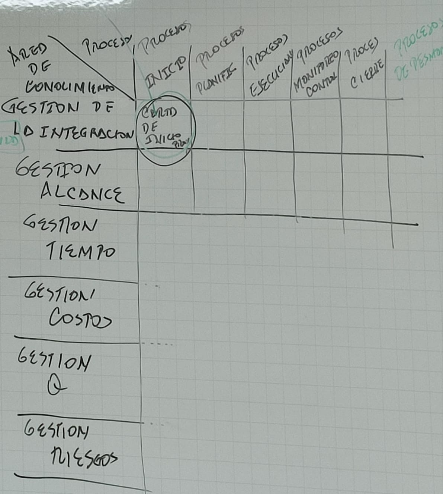

# ADMINISTRACION DE PROYECTOS DE SOFTWARE

## Contenido

	C1: Generalidades sobre los proyectos y la gestion de proyectos

		* Incidencia de la organizacion 
		* Gestion de integracion 

	C2-3: Metodologias: SCRUM, PSP, TSP

		Procesos de planificacion
		Gestion A /\ T + I + Adq
			     /Q \
			    ------
			      C
		Procesos de planificacion, medicion, analisis de sw

## Evaluacion(Leer Rubrica)

1er Parcial (30%) Sem 6a

	Contenido sem 1 - 5
	
	- Parcial escrito + actividades ----> 50%
	- Parcial en plataforma         ----> 50%

2do Parcial (25%) Sem 12ava

	Contenidos Sem 7 - 11

	- Parcial escrito + actividades ----> 50%
	- Parcial en plataforma         ----> 50%

3er Parcial (15%) Sem 16ava

	Contenido sem 13 - 16

	- Parcial escrito + actividades ----> 50%
	- Parcial en plataforma         ----> 50%

FINAL (30%) Sem 16 - 18

	Contenido -------> TODO

	- Parcial escrito + actividades ----> 50%
	- Parcial en plataforma         ----> 50%

plataforma.utp.edu.co

clave: 241UtpapsW

Profesor: Juan Veloza

Correo:   <veloza@utp.edu.co>

> **Nota:** Regla 8x3
> - 8 horas de sueño
> - 8 horas de trabajo
> - 8 horas para uno mismo

### Taller 1 respuestas:

#### ¿Qué es un Proyecto?

Un proyecto es un esfuerzo temporal que se lleva a cabo para crear un producto, servicio o resultado único. Se caracteriza por tener objetivos claros, un inicio y fin definidos, recursos específicos asignados y una planificación que contempla tiempos, costos y calidad.

### Ejemplos de: Portafolios, Programas y Proyectos

- Portafolios: Conjunto de proyectos o programas agrupados para gestionar eficazmente su ejecución y alinearlos con las estrategias organizacionales. Ejemplo: Portafolio de inversiones en energías renovables de una empresa.

- Programas: Conjunto de proyectos relacionados gestionados de manera coordinada para obtener beneficios que no se obtendrían si se gestionaran de manera individual. Ejemplo: Programa de desarrollo urbano que incluye proyectos de construcción de carreteras, parques y sistemas de transporte público.

- Proyectos: Iniciativas individuales con objetivos específicos. Ejemplo: Desarrollo de un nuevo software de gestión para una empresa.

### ¿Qué es la Dirección de Proyectos?

La Dirección de Proyectos es la aplicación de conocimientos, habilidades, herramientas y técnicas a las actividades del proyecto para cumplir con los requisitos del mismo. Incluye la planificación, ejecución y monitoreo de todas las fases del proyecto, así como la gestión de los recursos y la coordinación de los interesados.

### ¿Qué es PMI?

PMI significa Project Management Institute. Es una organización internacional sin fines de lucro que promueve las prácticas de gestión de proyectos, programas y portafolios. Ofrece certificaciones reconocidas en la industria, como PMP (Project Management Professional) y desarrolla estándares, como el PMBOK (Project Management Body of Knowledge).

### ¿Qué es PMBOK?

PMBOK es el acrónimo de Project Management Body of Knowledge. Es una guía publicada por el PMI que establece un conjunto de estándares y mejores prácticas para la gestión de proyectos. Sirve como una referencia fundamental para los profesionales de la gestión de proyectos en todo el mundo.

### ¿Como está estructurado el PMBOK?

El PMBOK está estructurado en torno a dos secciones principales: los grupos de procesos de la gestión de proyectos y las áreas de conocimiento. Los grupos de procesos incluyen: Iniciación, Planificación, Ejecución, Monitoreo y Control, y Cierre. Las áreas de conocimiento abarcan aspectos como la integración, el alcance, el tiempo, los costos, la calidad, los recursos humanos, las comunicaciones, el riesgo, las adquisiciones y los interesados. Cada área de conocimiento describe procesos específicos, prácticas, entradas, salidas y técnicas relacionadas.

## Semana 2

13//02//2024
> [Conceptos base](https://drive.google.com/file/d/1HwzPM1qpLjWD7UOzd5O_DF15Mhc85NsA/view?usp=drivesdk)
> 
### ¿Que es un proyecto?

Esfuerzo temporal :
- Crear único
    - Producto
        - Componente
        - Mejora
        - Elemento final
        
    - Servicio
        - Capaz de realizar mejorar
        
    - Resultado
        - Conclusión (Doc)
        - Inv. Nuevos procesos
        
- Temporal 
    - Inicio
        - Acta de constitución
    - Final: Cierre
        - Cuando se cumple o no se cumple el objetivo
        - la necesidad que originó el proyecto/ no existe 
        - cuando el patro inador decide no seguir

No significa corto
Ejemplo Desarrollo Nuevo producto/servicio/resultado
- Cambio organizacional
    - Estructura
    - Procesos
    - Personal
    - Estilo
- Desarrollo adq S.I
    - Nuevo modificado: HW/SW
- Investigación Registro y Documentación
- Construccion
    - Edificio
    - PlantaIndustrual
    - Infraestructura
- Procesos/Proced Neg: Implementar Mejorar Potenciar
#### ¿Que es la D.D.P?
Aplicar conocimiento; Habilidades herramientas
Técnicas
- Actividad del proyecto
- Cumplir con requisitos
Aproximadamente ≈ 50 procesos
- 5 grupos
    - I,P,E,M,S,C
    - Desmontar tecnologia

Aspectos: Identificar requisitos, abordar necesidades
- Inquietudes --> Interesados, Planificación, Ejecución
- Establecer/Mantener com: Act, Efic, Colaborativa
- Gestionar interesados
    - Cumplir req
    - Generar entregas
- Equilibrar restricciones contrapuestas (tiempo, alcance, costo, calidad, riesgos)
##### Relacioniones entre D.D.Portafolios, D.D.Programa, D.P.Proyecto
- Estrategias organizacional, objetivos organizacionales
- Estrategia por dependencia, objetivos por dependencia
- Lograr un alcance determinado, Cumplir obj P.P
#### Proyectos/Planeación Estrategica
Demanda del mercado, oportunidad/necesidad
Necesidad social, Consideración ambiental
Solicitud de un cliente, avance tecnológico
Req legal
#### Relación entre la D.D.P y Gestión de las operaciones
Estrategia organizacional
- Gestión de operaciones
    - Mejora de Op
- Interesados operacionales
    - Op de planta, supervisores
    - servicio, análisis de soporte
    - ventas
    - P.mtto
    - call center
    - minoristas
    - gerentes de línea 
    - responsables de capacitación 
- Organización y DDP <-- Empresas de SW
    - DDP alineada (cambio) con ob estratégicos (exito)
    - Organizaciones basadas en proyectos 
    - DDP gobierno corporativo,
- Valor del negocio
    - Concepto único para c/organización
- VLR TOTAL
    - Tangibles (Plantas, equipos, Infraestructura, Acción
    - Intangibles (Buena voluntad, Recon de marca, beneficio público, marca registrada)
    - Buena D.D.P, D.D.P, D.D.P
        - Garantiza Buena inv
#### ROL DEL D.D.P
Responsable liderar equipo ≠ Gerente, funcional
- Conocimiento D.D.P, Desempeño, personal
#### HABILIDADES
Liderazgo, trabajo en equipootivacion, comunicación, influencia, toma de decisiones, conocer política/ cultura, negociar, generar confianza, gestión conflictos, proporcionar orientación
Invierte en tu trabajo
- Ganarás un buen salario

Invierte en ti
- Ganarás Felicidad

## Semana 3
20//02//2024
[Guia del capítulo 2](https://drive.google.com/file/d/0B7n8RzXasByxSVJCMlJDSVB3c3M/view?usp=drivesdk&resourcekey=0-slEn9g4m0z83BITQKojdWQ)
### Capitulo 2: La organización
- Influencia de la organización en la DDP
- Interesados del proyecto  / Gobernabilidad
- Equipo del proyecto
- Ciclo de vida del proyecto
### Influencia de la organización en la DDP
**Culturas/estilos organizacionales**
Vision/Misión/Valores/creencias y expectativas
Normas, políticas, métodos y procedimientos
Sistemas de motivación / incertidumbre tolerancia al riesgo. Percepción de liderazgo, jerarquía, relaciones de autoridad , código de conducta ética, laboralz y horario de trabajo entramos operativos

**Estructuras de la organización**
Funcional matricial, (débil, equilibrado, fuerte)
Orientada a proyectos

**Activos de los procesos de la organización**
**FAE** -->Estradas mínimas de todo proceso DDP
### Interesados
Vendedores, socios del negocio, grupos de la organización, gerentes funcionales, otros interesados
### Equipo del proyecto 
Personal de la DDP, personal del proyecto, expertos de apoyo, representantes de usuario/ cliente, vendedore, miembros de presas socias, socios del negocio
### Ciclo de vida del proyecto
**Características**
Relación entre fases
- secuencial
- superpuesta
**Ciclo de vida predictivos**
Req, fact, plan, diseño, construcc, pruebas, entrega
**Ciclos de vida iterativos incrementales**
**Ciclos de vida adaptativos**
### Activos de los procesos de la organización
___Procesos / Procedimientos:___ I,P,E,M,S,C
___Bases del conocimiento___ 
B.d.c la gestión de configuración
Contiene ver, líneas base ,b.d.c, financieras, 
Información historica, lecciones aprendidas, B.d.d incidentes / defectos, inf de control
B.d.d para medición de procesos
Archivos de proyectos anteriores
### Factores ambientales de la empresa
La cultura estructura y gobierno de la organización
La distribución geográfica de inatalar y recursos
Los estándares de la industria/ gubernamentales, las Infraestructura, los R.H existen la gestión de personalos sistemas de autoridad de trabajo, las condiciones del mercado, tolerancia al riesgo, climativo, canales de comunicación, las b.d.d comerciales, los S.I para D.D.P

## GESTION DE INTEGRACION

### ACTA DE CONSTITUCION DEL PROYECTO

Desarrollar el acta de constitución del proyecto es el proceso de desarrollar un documento que autoriza formalmente la existencia de un proyecto y confiere al director del proyecto la autoridad para asignar los recursos de la organizacion a las actividades del proyecto.

- Beneficio clave: Inicio/limites del proyecto bien definidos, creacion de registro formal del proyecto y el establecimiento <-> compromiso de la organizacion

### ENTRADAS

- Enunciado del trabajo del proyecto
- Caso de negocio
- Acuerdos
- F.A.E
- A.P.O

### HERRAMIENTAS Y TECNICAS

- Juicio de expertos
- Facilitacion

### SALIDAS

- Acta de constitucion del proyecto

### ENUNCIADO DEL TRABAJO DEL PROYECTO

Descripcion narrativa de los productos servicios, resultados (Necesidades)

### CASO DE NEGOCIO

Informacion necesaria desde una perspectiva del negocio.

-Demanda del mercado: Necesidad de la organizacion, Solicitud de un cliente, avance tecnologico, Req legales, Impacto ecologico, necesidad social

### ACUERDOS

Contratos, memorandos de entendimiento, cartas de intencion, acuerdos verbales, acuerdo de niveles de servicio

"Intenciones iniciales del proyecto"

### FACTORES AMBIENTALES DE LA EMPRESA

Estandares Gubernamentales, Cultura/Estructura de la organizacion.

"Condiciones del mercado"

### ACTIVOS DE LOS PROCESOS DE LA ORGANIZACION

Procesos estandar de la organizacion

Plantillas, Informacion historica, bases de conocimiento

### ACTA DE CONSTITUCION

- Proposito/Justificacion del proyecto
- Objetivos medibles del proyecto <-> Criterios Exito
- Requisitos de alto nivel
- Supuestos y restricciones
- Descripcion de alto nivel del proyecto <-> limites
- Los riesgos de alto nivel
- Cronograma <-> Resumen hitos
- Resumen ppto
- Lista de interesados
- Requisitos de aprobacion <-> Director

CASO DE ESTUDIO

- Hidroituango
